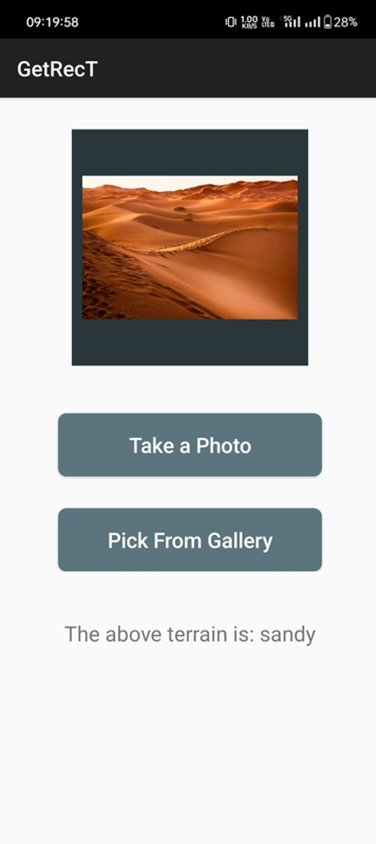
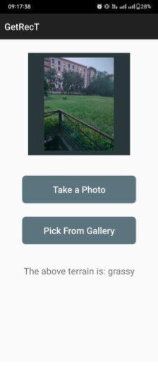
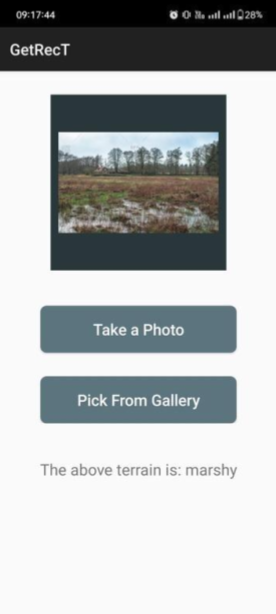
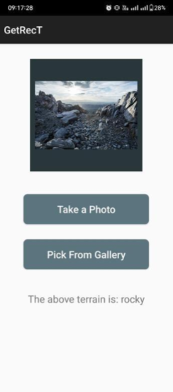

# 📱 GetRecT (Get Recognised Terrain) – Android App for Terrain Recognition

## 🚀 Overview

**GetRecT** is an Android application that uses an integrated `.tflite` model to classify terrain images in real-time. The app can analyze input from the device camera or from gallery images to predict the terrain type with high accuracy.

---

## 📲 Features

- 📸 Real-time terrain recognition using device camera  
- 🖼️ Classify stored images from the gallery  
- ⚡ On-device inference using TensorFlow Lite  
- 📈 Clean UI with probability-based predictions  
- 🧠 Lightweight and fast – no internet required

---

## 🛠️ Tech Stack

- **Kotlin** – Application backend  
- **Android Studio** – Development environment  
- **TensorFlow Lite** – For running the pre-trained ML model on-device  
- **XML** – UI layout and design

---

## 📷 App Screenshots

Below are some screenshots showcasing the functionality of the app:

<div style="display: flex; justify-content: space-between;">
    
    
    
    
</div>

---

## 📦 Installation

1. **Clone the repository**:
   ```bash
   git clone <repository-url>
   cd <repository-directory>
